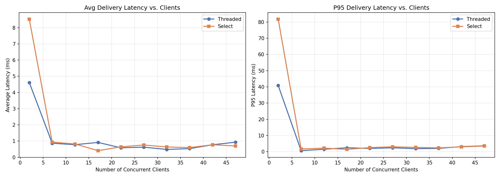
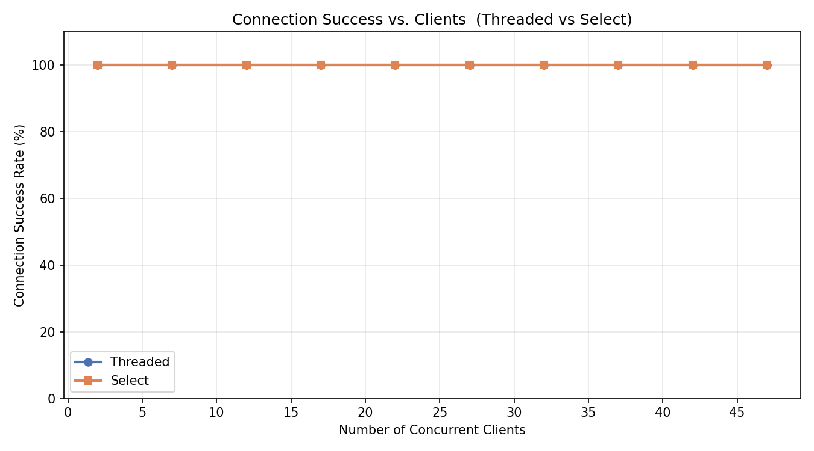

# Multi-User Chat System — Threaded vs Select Server

A TCP-based multi-user chat application built in C++ featuring a discovery server for user registration, **two chat server implementations** (thread-per-client and `select()`-based I/O multiplexing) for real-time messaging, and an interactive command-line client. Includes a comprehensive Python-based performance monitoring suite with **side-by-side comparison benchmarks**.

---

## Table of Contents

1. [System Architecture Overview](#system-architecture-overview)
2. [Protocol Specification](#protocol-specification)
3. [Compilation and Execution Instructions](#compilation-and-execution-instructions)
4. [Performance Analysis — Threaded vs Select](#performance-analysis--threaded-vs-select)
5. [Testing Guide](#testing-guide)

---

## System Architecture Overview

The system follows a **three-tier client-server architecture**. Two independent chat server implementations share the same binary protocol and can be swapped interchangeably:

```
┌─────────────┐         ┌────────────────────┐
│  Chat Client │◄───────►│  Discovery Server   │
│  (N clients) │  TCP    │  (Port 5000)        │
│              │         │  - User registration│
│  chat_client │         │  - Credential store  │
└──────┬───┬──┘         └────────────────────┘
       │   │
       │   │    ┌──────────────────────────────────┐
       │   └───►│  Threaded Chat Server             │
       │  TCP   │  chat_server  (Port 6000)         │
       │        │  - std::thread per client          │
       │        │  - std::mutex for shared state     │
       │        └──────────────────────────────────┘
       │                       OR
       │        ┌──────────────────────────────────┐
       └───────►│  Select Chat Server               │
          TCP   │  chat_server_select  (Port 6000)  │
                │  - Single-threaded, select() loop  │
                │  - Per-client read buffer           │
                └──────────────────────────────────┘
```

### Component Details

#### 1. Discovery Server (`discovery_server.cpp` — Port 5000)
- **Role**: Acts as a name/registration service (analogous to DNS).
- Listens on TCP port 5000 for incoming registration requests.
- On receiving a `REGISTRATION` message, stores user credentials (`username`, `password`, `IP`, `port`) to `users.txt`.
- Sends an `OK` confirmation back to the client upon successful registration.
- Runs in a **single-threaded, iterative** loop (one connection at a time).

#### 2a. Threaded Chat Server (`chat_server_threaded.cpp` — Port 6000)
- **Role**: Central relay for all chat communication.
- Spawns a **detached `std::thread`** for each connecting client (thread-per-client model).
- Uses `std::mutex` to protect the shared `active_clients` map from race conditions.
- Each thread independently reads from its client socket in a blocking loop.

#### 2b. Select Chat Server (`chat_server_select.cpp` — Port 6000)
- **Role**: Same as threaded — identical protocol and features.
- Uses a **single-threaded event loop** with `select()` for I/O multiplexing.
- Maintains a `ClientState` struct per file-descriptor with a read buffer to handle TCP fragmentation.
- `drain_buffer()` extracts complete messages from partial reads, handling multiple messages per `read()` call.
- No mutexes needed — all state access is sequential in one thread.

Both servers support the same operations:
- **Login** — verifies credentials against the user store.
- **Broadcast** — relays a message to all connected clients (except the sender).
- **Private Message** — delivers a message to a specific online user.
- **User Query** — returns a list of all registered users with their active/inactive status.

#### 3. Chat Client (`chat_client.cpp`)
- **Role**: Interactive user-facing terminal application.
- Workflow:
  1. Registers with the discovery server (port 5000).
  2. Logs in to the chat server (port 6000).
  3. Spawns a background **receiver thread** to asynchronously print incoming messages.
  4. Reads user commands from `stdin` in the main thread.
- Supported commands:
  - `/all <message>` — Broadcast to all online users.
  - `/msg <user> <message>` — Send a private message.
  - `/users` — List all registered users and their status.
  - `/quit` — Disconnect and exit.

### Architectural Comparison

| Aspect | Threaded Server | Select Server |
|---|---|---|
| **Concurrency model** | One OS thread per client | Single thread, `select()` event loop |
| **Shared state protection** | `std::mutex` on `active_clients` | Not needed — single-threaded |
| **Partial read handling** | Blocking `read()` in per-thread loop | Per-client `read_buf` + `drain_buffer()` |
| **Client state storage** | Thread-local variables | `ClientState` struct per fd |
| **Scalability limit** | OS thread count / stack memory | `FD_SETSIZE` (typically 1024) |
| **Code complexity** | Simpler logic, mutex discipline | More bookkeeping, no race conditions |

### Data Flow

```
Registration:   Client ──REGISTRATION──► Discovery Server ──"OK"──► Client
Login:          Client ──LOGIN──────────► Chat Server ──"OK"/"FAIL"─► Client
Broadcast:      Client ──BROADCAST──────► Chat Server ──(relay)─────► All other clients
Private Msg:    Client ──PRIVATE_MSG────► Chat Server ──(forward)───► Target client
User Query:     Client ──QUERY_USER─────► Chat Server ──(user list)─► Client
```

---

## Protocol Specification

All communication uses a **custom binary protocol** over TCP sockets, defined in `protocol.h`.

### Message Types

| Code | Enum Name      | Direction                    | Description                          |
|------|----------------|------------------------------|--------------------------------------|
| 1    | `REGISTRATION` | Client → Discovery Server    | Register a new user account          |
| 2    | `LOGIN`        | Client → Chat Server         | Authenticate with credentials        |
| 3    | `BROADCAST`    | Client → Chat Server → All   | Send message to all online users     |
| 4    | `PRIVATE_MSG`  | Client → Chat Server → User  | Send message to a specific user      |
| 5    | `QUERY_USER`   | Client → Chat Server         | Request list of registered users     |
| 6    | `STATUS_UPDATE`| Client → Chat Server         | Change user status (reserved)        |

### Packet Format

Every packet consists of a **fixed-size header** followed by a **variable-length payload**.

```
┌──────────────────────────────────────────────────────────────────┐
│                        MsgHeader (72 bytes)                      │
├─────────────┬─────────────────┬──────────────┬──────────────────┤
│  type       │  payload_length │    sender    │     target       │
│  (int32_t)  │  (int32_t)      │  (char[32])  │  (char[32])      │
│  4 bytes    │  4 bytes        │  32 bytes    │  32 bytes        │
├─────────────┴─────────────────┴──────────────┴──────────────────┤
│                     Payload (variable length)                    │
│               Length = payload_length bytes                      │
└──────────────────────────────────────────────────────────────────┘
```

### Header Fields

| Field            | Type       | Size     | Description                                      |
|------------------|------------|----------|--------------------------------------------------|
| `type`           | `int32_t`  | 4 bytes  | Message type enum (1–6)                           |
| `payload_length` | `int32_t`  | 4 bytes  | Length of the payload in bytes                    |
| `sender`         | `char[32]` | 32 bytes | Null-padded username of the sender                |
| `target`         | `char[32]` | 32 bytes | Null-padded username of the recipient (if applicable) |

### Payload Content by Message Type

| Message Type     | Payload Content                              |
|------------------|----------------------------------------------|
| `REGISTRATION`   | Password (plaintext string)                  |
| `LOGIN`          | Password (plaintext string)                  |
| `BROADCAST`      | Message text                                 |
| `PRIVATE_MSG`    | Message text                                 |
| `QUERY_USER`     | Empty (request); User list string (response) |
| `STATUS_UPDATE`  | New status string                            |

### User Store (`users.txt`)

The discovery server persists user data as a flat text file with space-separated fields:

```
<username> <password> <IP> <port>
```

Example:
```
alice pass123 127.0.0.1 54321
bob   secret  127.0.0.1 54322
```

---

## Compilation and Execution Instructions

### Prerequisites

- **Compiler**: g++ with C++17 support
- **OS**: Linux (uses POSIX sockets and `/proc` filesystem for monitoring)
- **Python 3.10+** (for test/monitoring suite)
- **Python packages**: `matplotlib`, `numpy` (for visualization only)

### Building

```bash
cd /path/to/Assignment-02

# Build all binaries
make

# This produces:
#   discovery_server
#   chat_server            (compiled from chat_server_threaded.cpp)
#   chat_server_select     (compiled from chat_server_select.cpp)
#   chat_client
```

To clean build artifacts:
```bash
make clean
```

### Running the System

**Step 1 — Start the Discovery Server:**
```bash
./discovery_server &
# Output: Discovery Server (DNS) active on port 5000...
```

**Step 2 — Start ONE of the Chat Servers:**
```bash
# Option A: Threaded server
./chat_server &
# Output: Threaded Chat Server active on port 6000...

# Option B: Select server
./chat_server_select &
# Output: Select Chat Server active on port 6000...
```

**Step 3 — Start Chat Clients** (in separate terminals):
```bash
./chat_client
# Prompts for username and password, then opens interactive chat
```

### Client Usage

```
=== Chat Client ===
Username: alice
Password: pass123

Commands:
  /all <message>        — broadcast to everyone
  /msg <user> <message> — private message
  /users                — list online users
  /quit                 — exit

> /all Hello everyone!
> /msg bob Hey Bob, are you there?
> /users
> /quit
```

### Stopping Servers

```bash
pkill -f discovery_server
pkill -f chat_server
```

---

## Performance Analysis — Threaded vs Select

Both servers were benchmarked under identical conditions using the automated testing suite. The load test used **10 concurrent clients sending 20 messages each**, and the stress test scaled from **2 to 47 clients** in steps of 5.

### 1. Message Delivery Latency


| Metric | Threaded Server | Select Server |
|---|---|---|
| **Median latency** | 0.216 ms | 0.151 ms |
| **Mean latency** | 0.581 ms | 0.294 ms |
| **Max latency** | 43.197 ms | 1.700 ms |
| **Std deviation** | 3.058 ms | 0.310 ms |

**Analysis**: The select server delivers messages with **lower and more consistent latency**. The threaded server occasionally shows latency spikes up to ~43 ms, likely caused by **thread scheduling jitter** — when the OS scheduler context-switches between many threads, some broadcasts experience delays. The select server avoids this entirely because all I/O is processed sequentially in a single event loop, eliminating context-switch overhead.

### 2. Average & P95 Latency vs. Client Count



Both servers maintain sub-1 ms average latency at all tested client counts (up to 47). The key difference is the **tail latency** (P95): the threaded server's P95 climbs to ~3.7 ms at 47 clients, while the select server stays at ~3.5 ms. At lower client counts (17 clients), the select server achieves a P95 of just 1.5 ms vs the threaded server's 2.5 ms.

### 3. CPU Usage vs. Client Count


| Clients | Threaded CPU% | Select CPU% |
|---|---|---|
| 7 | 0.08% | 0.00% |
| 17 | 0.17% | 0.13% |
| 27 | 0.43% | 0.34% |
| 37 | 0.47% | 0.42% |
| 47 | 0.60% | 0.42% |

**Analysis**: The select server consistently uses **less CPU** than the threaded server, and the gap widens as client count increases. At 47 clients, the threaded server uses 0.60% CPU vs the select server's 0.42% — a **30% reduction**. This is because:
- The threaded server has **N idle threads** blocked on `read()` system calls, each consuming kernel scheduling overhead.
- The select server has **one thread** making a single `select()` call that monitors all file descriptors at once, requiring fewer syscalls and zero context switches between worker threads.

### 4. Memory Usage vs. Client Count


| Clients | Threaded VmRSS | Select VmRSS | Threaded PSS | Select PSS |
|---|---|---|---|---|
| 7 | 3,712 KB | 3,584 KB | 454 KB | 421 KB |
| 27 | 3,840 KB | 3,584 KB | 910 KB | 453 KB |
| 47 | 4,480 KB | 3,584 KB | 1,370 KB | 497 KB |

**Analysis**: This is the most dramatic difference. The select server's memory stays **completely flat at 3,584 KB** regardless of client count, while the threaded server grows from 3,712 KB to **4,480 KB** (+25%). The PSS (Proportional Set Size) tells an even starker story: the threaded server's PSS grows from 454 KB to **1,370 KB** (3x increase), while the select server only goes from 421 KB to **497 KB** (+18%).

This is because **every thread in the threaded server allocates its own stack** (typically 8 MB virtual / ~128 KB resident per thread on Linux). The select server stores all client state in lightweight `ClientState` structs (a few hundred bytes each) within a single process address space.

### 5. Connection Success Rate



Both servers achieved **100% connection success** at all tested client counts (2–47 clients), confirming that both architectures are robust and reliable under this load level.

### Summary

| Metric | Winner | Why |
|---|---|---|
| **Latency consistency** | Select | No thread scheduling jitter; single event loop |
| **CPU efficiency** | Select | One `select()` call vs N blocked `read()` threads |
| **Memory efficiency** | Select | No per-thread stack allocation |
| **Connection reliability** | Tie | Both 100% at tested scale |
| **Code simplicity** | Threaded | Thread-per-client is more intuitive to write |
| **Max scalability** | Threaded* | Select limited to `FD_SETSIZE` (1024); threads limited by OS/memory |

\* For extremely high client counts (>1024), `epoll`/`kqueue` would be needed instead of `select()`. For the tested range (≤50 clients), the select server is more efficient in every measured dimension.

---

## Testing Guide

### Testing Suite Overview

The `monitoring/` directory contains a full Python-based test and monitoring framework:

| File               | Purpose                                                       |
|--------------------|---------------------------------------------------------------|
| `protocol.py`      | Python implementation of the binary protocol (mirrors `protocol.h`) |
| `monitor_server.py`| Collects CPU%, VmRSS, PSS for the server process at intervals |
| `load_test.py`     | Simulates 10 concurrent clients sending 20 messages each      |
| `stress_test.py`   | Gradually increases clients (2 → 50) to find degradation      |
| `visualize.py`     | Generates comparison plots (Threaded vs Select)                |
| `run_all.py`       | One-command orchestrator: build → test both servers → plots    |

### Quick Start — Run All Tests

```bash
cd monitoring/
pip install matplotlib numpy    # install dependencies (one-time)

# Run everything — tests both servers, generates comparison plots
python3 run_all.py

# Test only one server variant
python3 run_all.py --only threaded
python3 run_all.py --only select

# Skip specific phases
python3 run_all.py --skip-build --skip-stress
```

### Running Individual Tests

First, start the servers manually from the project root:
```bash
./discovery_server &
./chat_server &          # or ./chat_server_select &
```

Then run specific tests:

```bash
cd monitoring/

# Load Test — 10 clients, 20 messages each (threaded server)
python3 load_test.py --clients 10 --messages 20 --server-label threaded --server-bin chat_server

# Load Test — same for select server
python3 load_test.py --clients 10 --messages 20 --server-label select --server-bin chat_server_select

# Stress Test — scale from 2 to 50 clients
python3 stress_test.py --start 2 --step 5 --max 50 --msgs 10 --server-label threaded

# Generate comparison plots from existing CSV data
python3 visualize.py

# Monitor server resources standalone
python3 monitor_server.py --pid $(pgrep -f chat_server | head -1) --interval 2
```

### Test Descriptions

#### Load Test (`load_test.py`)
- Spawns N concurrent clients that register, log in, and send broadcast messages.
- All clients synchronize at a barrier before sending to ensure simultaneous load.
- Measures **per-message delivery latency** (time from send to receiving a broadcast echo).
- Monitors server CPU and memory consumption during the test.
- **Output**: `metrics/<label>_load_test_latency.csv`, `metrics/<label>_load_test_server_metrics.csv`

#### Stress Test (`stress_test.py`)
- Incrementally increases client count in steps (default: 2, 7, 12, …, 47).
- At each step, every client sends a configurable number of broadcast messages.
- Measures: connection success rate, avg/max/p95 latency, CPU%, memory.
- Automatically stops if **degradation** is detected (>50% failed connections or latency >5s).
- **Output**: `metrics/<label>_stress_test_results.csv`, `metrics/<label>_stress_test_server_metrics.csv`

#### Visualization (`visualize.py`)
Generates five comparison plots saved to `metrics/plots/`:
1. **`message_delivery_time.png`** — Histogram + boxplot of delivery latencies (both servers overlaid).
2. **`cpu_vs_clients.png`** — Server CPU usage as concurrent clients increase.
3. **`memory_vs_clients.png`** — Server VmRSS and PSS as clients increase.
4. **`avg_latency_vs_clients.png`** — Average and P95 latency per stress-test step.
5. **`connection_success.png`** — Connection success rate per step.

### Test Output Structure

```
monitoring/metrics/
├── threaded_load_test_latency.csv            # Threaded: per-message latency
├── threaded_load_test_server_metrics.csv      # Threaded: CPU/memory during load
├── threaded_stress_test_results.csv           # Threaded: per-step stress summary
├── threaded_stress_test_server_metrics.csv    # Threaded: CPU/memory during stress
├── select_load_test_latency.csv              # Select: per-message latency
├── select_load_test_server_metrics.csv        # Select: CPU/memory during load
├── select_stress_test_results.csv             # Select: per-step stress summary
├── select_stress_test_server_metrics.csv      # Select: CPU/memory during stress
└── plots/
    ├── message_delivery_time.png              # Latency distribution comparison
    ├── cpu_vs_clients.png                     # CPU vs. client count
    ├── memory_vs_clients.png                  # Memory vs. client count
    ├── avg_latency_vs_clients.png             # Avg + P95 latency vs. clients
    └── connection_success.png                 # Connection success rate
```

### Manual Functional Testing

You can manually test the system with multiple terminal windows:

```bash
# Terminal 1 — Discovery Server
./discovery_server

# Terminal 2 — Chat Server (pick one)
./chat_server              # threaded
# OR
./chat_server_select       # select-based

# Terminal 3 — Client A
./chat_client
# Enter: alice / pass1

# Terminal 4 — Client B
./chat_client
# Enter: bob / pass2

# In Client A: /all Hello from Alice!
# Client B should receive: [alice -> ALL]: Hello from Alice!

# In Client B: /msg alice Private reply
# Client A should receive: [bob -> YOU]: Private reply

# In either: /users
# Should list both alice and bob as active
```
