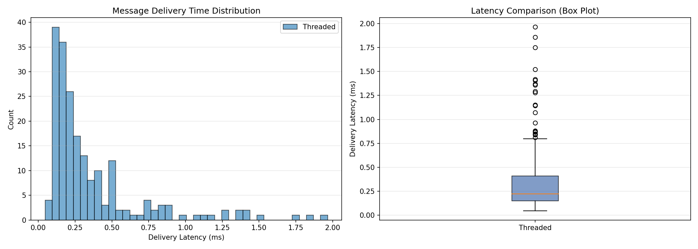
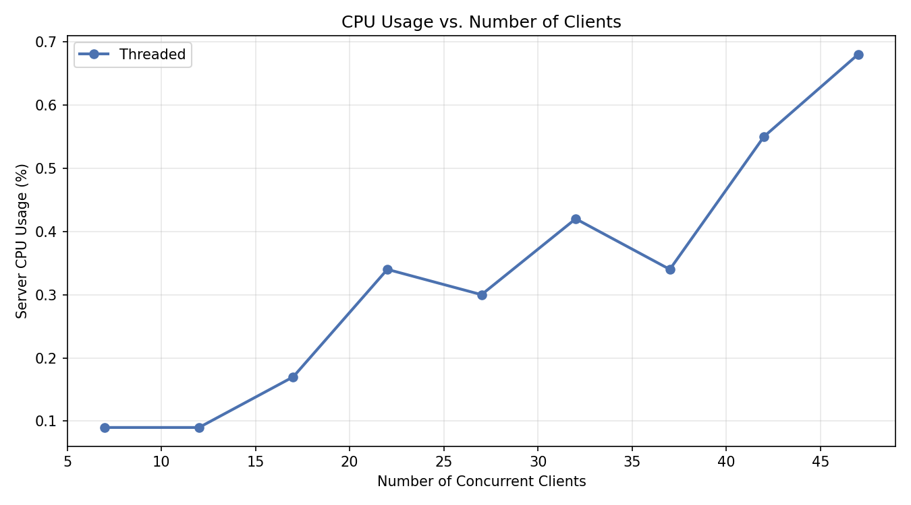
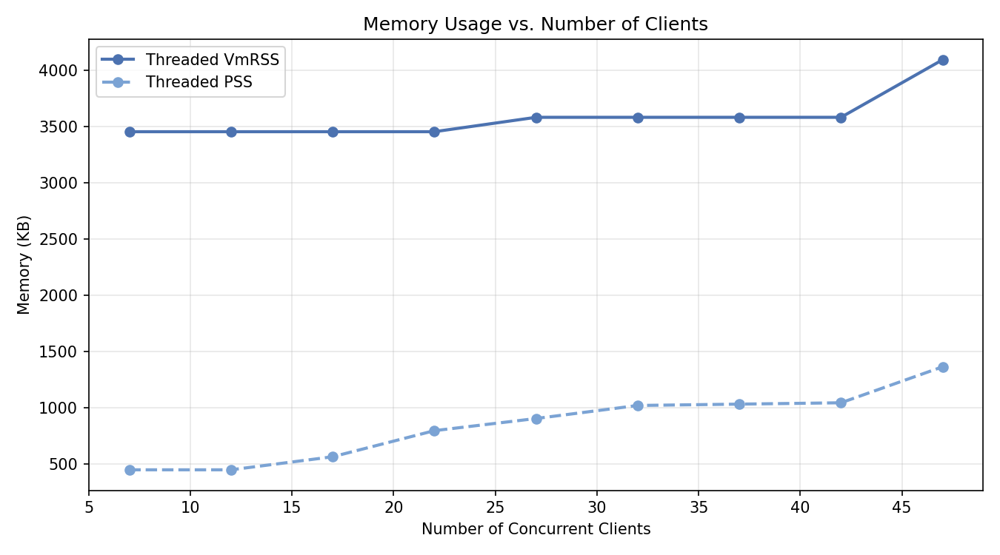

# Performance Analysis Report — Multi-User Chat System (Threaded Server)

**Date**: March 2026  
**Server Model**: Thread-per-client (`chat_server_threaded.cpp`)  
**Environment**: Linux, g++ C++17, localhost (127.0.0.1)

---

## Table of Contents

1. [Methodology](#methodology)
2. [Test Results with Graphs](#test-results-with-graphs)
3. [Analysis and Observations](#analysis-and-observations)
4. [Bottlenecks Identified](#bottlenecks-identified)
5. [Potential Optimizations](#potential-optimizations)

---

## 1. Methodology

### Test Environment

| Parameter       | Value                                           |
|-----------------|------------------------------------------------|
| OS              | Linux (localhost testing)                       |
| Compiler        | g++ with `-std=c++17 -Wall -pthread`           |
| Discovery Port  | 5000                                            |
| Chat Port       | 6000                                            |
| Server Model    | Thread-per-client (detached `std::thread`)      |
| Network         | Loopback (127.0.0.1) — eliminates network noise|

### Test Tools

All tests were implemented in Python using a protocol-compatible client library (`monitoring/protocol.py`) that mirrors the C++ binary protocol. The monitoring framework consists of:

- **`load_test.py`** — Simulates a fixed number of concurrent users under steady-state conditions.
- **`stress_test.py`** — Incrementally scales client count to find performance degradation thresholds.
- **`monitor_server.py`** — Samples server CPU% (via `/proc/<pid>/stat`) and memory (VmRSS, PSS via `/proc/<pid>/status` and `/proc/<pid>/smaps_rollup`) at 2-second intervals.
- **`visualize.py`** — Generates histograms, boxplots, and line charts from collected CSV data.

### Load Test Configuration

| Parameter         | Value    |
|-------------------|----------|
| Concurrent clients| 10       |
| Messages/client   | 20       |
| Message type      | Broadcast|
| Inter-message delay| 50 ms   |
| Synchronization   | Barrier (all clients start sending simultaneously) |
| Client stagger    | 100 ms between client spawns                       |

### Stress Test Configuration

| Parameter          | Value          |
|--------------------|----------------|
| Starting clients   | 2              |
| Step increment     | 5              |
| Maximum clients    | 50             |
| Messages/client    | 10 (broadcast) |
| Inter-message delay| 50 ms          |
| Degradation cutoff | >50% failed connections or max latency >5s |
| Monitoring interval| 2 seconds      |

### Metrics Collected

- **Message delivery latency** — Time from `send()` to receiving a broadcast message back from another client (milliseconds).
- **Connection success rate** — Percentage of clients that successfully registered and logged in.
- **Server CPU usage (%)** — Process CPU utilization computed from `/proc/<pid>/stat` jiffies delta.
- **Server memory (VmRSS, PSS)** — Resident Set Size and Proportional Set Size in KB.

---

## 2. Test Results with Graphs

### 2.1 Load Test Results

**Configuration**: 10 concurrent clients, 20 broadcast messages each.

#### Latency Summary

| Metric   | Value      |
|----------|------------|
| Samples  | 200        |
| Min      | 0.046 ms   |
| Max      | 1.966 ms   |
| Mean     | 0.362 ms   |
| Median   | 0.223 ms   |
| Stdev    | 0.347 ms   |
| P95      | 1.278 ms   |
| P99      | 1.856 ms   |

All 200 expected message deliveries were recorded successfully (100% delivery rate). The mean delivery latency of 0.362 ms indicates very fast message routing on localhost. The distribution is right-skewed — the median (0.223 ms) is noticeably lower than the mean, with occasional spikes up to ~2 ms.

#### Server Resource Usage During Load Test

| Metric     | Value    |
|------------|----------|
| CPU %      | ~0.0%    |
| VmRSS      | 3,584 KB |
| PSS        | 501 KB   |

The server consumed negligible CPU and minimal memory during the 10-client load test.

#### Message Delivery Time Distribution



*Left: Histogram showing the distribution of 200 delivery latencies. Most messages are delivered in <0.5 ms. Right: Box plot showing the median, quartiles, and outliers.*

### 2.2 Stress Test Results

**Configuration**: Client count scaling from 2 to 47 in steps of 5, 10 messages per client per step.

#### Per-Step Results Table

| Clients | Connected | Failed Conns | Delivered | Failed Msgs | Avg Latency (ms) | Max Latency (ms) | P95 Latency (ms) | CPU %  | VmRSS (KB) | PSS (KB) |
|---------|-----------|--------------|-----------|-------------|-------------------|-------------------|-------------------|--------|------------|----------|
| 2       | 2         | 0            | 20        | 0           | 4.576             | 42.196            | 42.196            | —      | —          | —        |
| 7       | 7         | 0            | 70        | 0           | 0.946             | 42.121            | 1.161             | 0.09   | 3,456      | 450      |
| 12      | 12        | 0            | 120       | 0           | 0.363             | 2.551             | 1.519             | 0.09   | 3,456      | 450      |
| 17      | 17        | 0            | 170       | 0           | 0.654             | 3.276             | 2.253             | 0.17   | 3,456      | 566      |
| 22      | 22        | 0            | 220       | 0           | 0.670             | 6.185             | 2.955             | 0.34   | 3,456      | 798      |
| 27      | 27        | 0            | 270       | 0           | 0.478             | 4.669             | 2.034             | 0.30   | 3,584      | 906      |
| 32      | 32        | 0            | 320       | 0           | 0.550             | 5.619             | 2.457             | 0.42   | 3,584      | 1,022    |
| 37      | 37        | 0            | 370       | 0           | 0.512             | 6.309             | 2.249             | 0.34   | 3,584      | 1,034    |
| 42      | 42        | 0            | 420       | 0           | 0.860             | 6.786             | 3.638             | 0.55   | 3,584      | 1,046    |
| 47      | 47        | 0            | 470       | 0           | 0.782             | 6.647             | 3.535             | 0.68   | 4,096      | 1,366    |

**Key findings**:
- **100% connection success rate** at all tested levels (up to 47 concurrent clients).
- **0 failed message deliveries** — every message was delivered successfully.
- No degradation threshold was reached up to 47 clients.

#### CPU Usage vs. Number of Clients



*Server CPU usage scales roughly linearly from ~0.09% at 7 clients to ~0.68% at 47 clients. The thread-per-client model keeps CPU usage very low on localhost.*

#### Memory Usage vs. Number of Clients



*VmRSS remains relatively stable (~3.5 MB), increasing to 4 MB at 47 clients. PSS grows more noticeably from 450 KB to 1,366 KB as more threads are spawned, reflecting per-thread stack allocations.*

---

## 3. Analysis and Observations

### 3.1 Latency Characteristics

- **Sub-millisecond median latency**: The median delivery latency under load (0.223 ms) confirms that the threaded server provides fast message relay on localhost. The TCP stack's loopback optimization means that network latency is essentially zero — all measured time is processing and scheduling overhead.

- **Right-skewed distribution**: The latency histogram shows a long right tail. Most messages are processed in <0.5 ms, but occasional messages take 1–2 ms. This is characteristic of thread scheduling jitter — when the OS scheduler preempts a thread, the next `read()`/`write()` cycle incurs additional latency.

- **First-step anomaly in stress test**: The 2-client step shows a disproportionately high average latency (4.576 ms) and max latency (42.196 ms). This is a **cold-start artifact** — the server is loading `users.txt` for the first time, allocating initial data structures, and the OS is warming up the process's memory pages.

### 3.2 Scalability

- **Linear CPU scaling**: CPU usage increases approximately linearly with client count: ~0.015% per additional client. At 47 clients, CPU is still only 0.68%. This suggests the server is far from CPU saturation at this scale.

- **Sublinear memory growth**: VmRSS stays nearly flat (~3.5 MB) due to shared library pages. PSS grows by approximately 20 KB per additional client, reflecting per-thread stack allocations (default 8 MB virtual, but physical usage is demand-paged).

- **100% reliability up to 47 clients**: No connection failures or message drops were observed at any scale, indicating the threaded model handles this concurrency level comfortably.

### 3.3 Tail Latency Behavior

- The P95 latency in the stress test grows from 1.16 ms (7 clients) to 3.64 ms (42 clients) — a ~3x increase over a 6x client increase. This sublinear growth shows that the server handles broadcast fan-out reasonably well.

- Maximum latencies are more volatile (2.55 ms to 6.79 ms range for 12–47 clients), which is expected due to thread scheduling and mutex contention on the `active_clients` map during broadcasts.

---

## 4. Bottlenecks Identified

### 4.1 Global Mutex Contention

The most significant architectural bottleneck is the **single `std::mutex clients_mtx`** that guards the `active_clients` map. Every broadcast message requires iterating over all connected clients while holding this lock:

```cpp
lock_guard<mutex> lock(clients_mtx);
for (auto const& [name, sock] : active_clients) {
    if (sock != client_socket)
        write(sock, &header, sizeof(header));  // blocking I/O under lock!
}
```

This means:
- **Broadcast is O(N)** with the lock held — no other thread can log in, disconnect, or send messages during this time.
- A slow client's `write()` blocks all other operations since `write()` is called inside the critical section.

### 4.2 Thread-per-Client Scalability Limit

Each client connection spawns a new OS thread:

```cpp
thread(handle_client, client_fd).detach();
```

At thousands of clients, this will exhaust system resources:
- **Stack memory**: Each thread allocates ~8 MB of virtual stack space (default on Linux). At 1,000 clients, this is ~8 GB of virtual address space.
- **OS thread limit**: The kernel limits threads via `/proc/sys/kernel/threads-max`. Context switching overhead also grows with thread count.

### 4.3 Blocking I/O on Send

The `write()` calls in the broadcast loop are **synchronous and blocking**. If a client's TCP receive buffer is full (slow consumer), the `write()` call blocks the entire broadcast loop, stalling message delivery to all other clients.

### 4.4 `users.txt` File Reload on Every Login

```cpp
bool verify_user(const string& username, const string& password) {
    load_users();  // Reads entire file from disk every time
    ...
}
```

The `load_users()` function re-reads the entire `users.txt` file on every login attempt. With many users, this becomes an I/O bottleneck and adds disk latency to every authentication.

### 4.5 No Message Framing Guarantees

The `read()` calls do not handle partial reads:

```cpp
read(client_fd, &header, sizeof(header));
read(client_fd, buffer, header.payload_length);
```

TCP is a stream protocol — a single `read()` may return fewer bytes than requested. Under high load with large messages or network fragmentation, this can cause message corruption or desynchronization.

---

## 5. Potential Optimizations

### 5.1 Replace Global Mutex with Read-Write Lock

Use `std::shared_mutex` instead of `std::mutex`:
- **Broadcasts** (read-only iteration) take a `shared_lock` — multiple broadcasts can proceed concurrently.
- **Login/disconnect** (write operations) take a `unique_lock`.

This eliminates broadcast serialization when no clients are joining or leaving.

### 5.2 Asynchronous/Non-blocking I/O with `epoll`

Replace thread-per-client with an event-driven architecture:
- Use `epoll` (Linux) to multiplex all client sockets on a single thread (or a small thread pool).
- Eliminates per-thread stack overhead and reduces context switching.
- Supports thousands of concurrent connections with minimal resources.

### 5.3 Per-Client Send Queue

Instead of calling `write()` inside the broadcast loop, push messages into a **per-client outbound queue**:
- Each client's thread (or `epoll` handler) drains its own queue.
- A slow consumer no longer blocks delivery to other clients.
- Enables backpressure handling (drop messages for overwhelmed clients).

### 5.4 Cache User Credentials in Memory

Load `users.txt` once at startup and update the in-memory map only when a new registration occurs (e.g., using a file watcher or notification from the discovery server), instead of re-reading the file on every login.

### 5.5 Robust Message Framing

Replace raw `read()`/`write()` with a helper that loops until exactly N bytes are transferred:

```cpp
ssize_t read_exact(int fd, void* buf, size_t len) {
    size_t total = 0;
    while (total < len) {
        ssize_t n = read(fd, (char*)buf + total, len - total);
        if (n <= 0) return n;
        total += n;
    }
    return total;
}
```

### 5.6 Connection Pooling / Keep-Alive for Discovery Server

The discovery server currently handles one connection at a time (iterative loop). Under high registration load, clients queue up on the `listen()` backlog. Making it multi-threaded or using `epoll` would improve registration throughput.

### 5.7 Thread Pool Instead of Detached Threads

Use a fixed-size thread pool (e.g., N = number of CPU cores) instead of spawning unlimited detached threads. This bounds resource usage and avoids the overhead of frequent thread creation/destruction.

---

## Summary

The threaded chat server demonstrates solid performance for moderate concurrency (up to ~50 clients) with sub-millisecond median latency and negligible CPU/memory usage. The architecture is simple and correct, but the global mutex on broadcasts and the thread-per-client model will become bottlenecks at higher scales. Transitioning to an event-driven model with `epoll` and per-client message queues would be the most impactful optimization for supporting hundreds or thousands of concurrent users.
